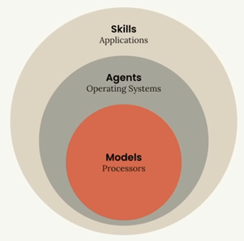

# 🤖 Anthropic Claude Code CLI

**Containerized Claude Code CLI (Hardened)**

---

## 📦 Latest Build

<!-- VERSION_INFO_START -->
| Component | Version |
|-----------|---------|
| **Anthropic Claude Code CLI** | [`2.1.212`](https://github.com/anthropics/claude-code/releases/tag/v2.1.216) |

> 🔄 Last updated: 2026-07-20T22:40:34Z · [Build #82](https://github.com/stefanbosak/claude-cli/actions/runs/29784593599)
<!-- VERSION_INFO_END -->

---

## 📋 Overview

This repository provides a fully automated preparation of **containerized** [Claude Code CLI](https://github.com/anthropics/claude-code) environment with integrated **MCP server** support using **Docker-in-Docker** architecture.

### About solution
- Sandboxing environment for AI scope (reduced possible negative impact via isolation)
- Automated packaging of current tool versions (optimized maintenance effort via automation)
- Strong focus on security (mitigated security issues and vulnerabilities through hardening)
- Simplification of the initial run-up (see: [Container runner script](./claude.sh), [Environment configuration](./.claude/.env))

- **Container image is:**
  - keyless-signed via cosign using GitHub OIDC certificate issuer (trusted verifiable source)
  - automatically built when a new release of Anthropic Claude is detected (scheduled monitoring - every hour)

### 📚 Resources

- 📖 [Official Documentation](https://platform.claude.com/docs/en/about-claude/models/overview)
- 📖 [AI models database](https://models.dev)
- 🤖 **Supported AI Models**: Haiku/Sonet, Opus
  - **Recommended models**:
    - **Claude Sonet** - [Documentation](https://www.anthropic.com/claude/sonnet)
    - **Claude Opus** - [Documentation](https://www.anthropic.com/claude/opus)
  - **Effective Prompting**:
    - Save output to prevent data loss (reduce costs)
    - Iteratively processing excessively long messages (drop error rate ~<10%)
    - XML tags ensure structural clarity (compliance increase to ~>98 %)
    - Validate continuously (maintain ~>95% accuracy)
    - Instruct what to avoid, not what to do (significantly reduce hallucination by ~>60 %)
    - Contextualize personas (~<15 % improvement using personas)

## 🧱 AI Layering

## Anthropic IP prefixes, subdomains for whitelisting, status
- [Anthropic IP prefixes]( https://docs.anthropic.com/en/api/ip-addresses)
- curl -s https://status.claude.com/api/v2/summary.json | jq '.status'

### ⚠️ Important Notices

> [!NOTE]
> All files in this repository are well-commented with relevant implementation details.

> [!IMPORTANT]
> Always review and understand the code before executing any commands.

> [!CAUTION]
> Users are solely responsible for any modifications or execution of code from this repository.

## 🛠 Utilities
- [uv](https://github.com/astral-sh/uv) - An extremely fast Python package installer and resolver
- [bun](https://github.com/oven-sh/bun) - All-in-one JavaScript runtime and toolkit for faster development
- [fabric](https://github.com/danielmiessler/fabric) - Framework for augmenting humans using AI
- [mdflow](https://github.com/johnlindquist/mdflow) - Markdown-based workflow automation tool for streamlined task execution

## 🔌 MCP Servers

> [!NOTE]
> Use custom agents with agent isolation to configure on-demand MCP servers.

### 🧠 Reasoning & Documentation

#### **sequentialthinking** - Step-by-Step Reasoning
- [skill](.claude/skills/sequential-thinking/SKILL.md)
- **Benefits:** Reduces token consumption by 5-55%
- **Documentation:** [Sequential Thinking MCP Server](https://github.com/modelcontextprotocol/servers/tree/main/src/sequentialthinking)

#### **ref** - Documentation Search
- [skill](.claude/skills/doc-search/SKILL.md)
- **Benefits:** Essential for efficient context retrieval
- **Documentation:** [Ref.tools](https://ref.tools/)

---

### 🌐 Utilities

#### **fetch** - Web Search
- [skill](.claude/skills/web-search/SKILL.md)
- **Documentation:** [Fetch MCP Server](https://github.com/modelcontextprotocol/servers/tree/main/src/fetch)

#### **time** - Time & Timezone
- [skill](.claude/skills/sequential-thinking/SKILL.md)
- **Documentation:** [Time MCP Server](https://github.com/modelcontextprotocol/servers/tree/main/src/time)

---

### 🗄️ Database & Storage

#### **postgres** - PostgreSQL
- [agent](.claude/agents/postgres.agent.md)
- [skill](.claude/skills/postgres/SKILL.md)
- **Documentation:** [MCP Toolbox for Databases](https://github.com/googleapis/genai-toolbox)
- ⚠ **Note:** Linux ARM64 architecture currently not supported ([issue](https://github.com/googleapis/genai-toolbox/issues/2754))

---

### 📊 Monitoring & Logging

#### **grafana** - Grafana
| test | production |
|------|------------|
| [agent](.claude/agents/grafana-tst.agent.md) | [agent](.claude/agents/grafana-prd.agent.md) |
| [skill](.claude/skills/grafana-tst/SKILL.md) | [skill](.claude/skills/grafana-prd/SKILL.md) |
- **Documentation:** [Grafana MCP Server](https://github.com/grafana/mcp-grafana)

#### **graylog** - Graylog
| test | production |
|------|------------|
| [agent](.claude/agents/graylog-tst.agent.md) | [agent](.claude/agents/graylog-prd.agent.md) |
| [skill](.claude/skills/graylog-tst/SKILL.md) | [skill](.claude/skills/graylog-prd/SKILL.md) |
- **Authentication:** Authorization header required
- **Documentation:** [Graylog MCP Documentation](https://go2docs.graylog.org/current/setting_up_graylog/model_context_protocol__mcp__tools.htm)

## 📁 Repository Structure

### Configuration Files
| File | Description |
|------|-------------|
| [`.env`](./.claude/.env) | Environment variables |

### Docker & Build
| File | Description |
|------|-------------|
| [`Dockerfile`](./Dockerfile) | Container image configuration |
| [`claude-build.sh`](./claude-build.sh) | Build automation script |
| [`claude.sh`](./claude.sh) | Execution wrapper script |
| [`act.sh`](./act.sh) | Act tool script |

## 🐳 Container Images

### Available Registries

| Registry | Network Support | Pull Command |
|----------|----------------|--------------|
| [**GitHub CR**](https://github.com/stefanbosak/claude-cli/pkgs/container/claude-cli) | IPv4 only | `docker pull ghcr.io/stefanbosak/claude-cli:initial` |
| [**Docker Hub**](https://hub.docker.com/r/developmententity/claude-cli) | IPv4 & IPv6 | `docker pull developmententity/claude-cli:initial` |

## Other resources

- [Claude best practice](https://github.com/shanraisshan/claude-code-best-practice)
- [Claude prompt templates](https://github.com/repowise-dev/claude-code-prompts)
- [BMAD](https://github.com/bmad-code-org/BMAD-METHOD)
- [claudectx](https://github.com/foxj77/claudectx)

---

**Made with ❤ for ⚡ efficiency and 🔒 security**

